# Pumpkin Platform – Cloud Engineer Case Study

## Overview

This repository contains a cloud-native platform deployment designed to run a containerized application on Azure Kubernetes Service (AKS). The solution demonstrates infrastructure provisioning using Terraform, application deployment using Helm, and DevSecOps CI/CD pipelines using GitHub Actions.

---

## * Architecture Overview

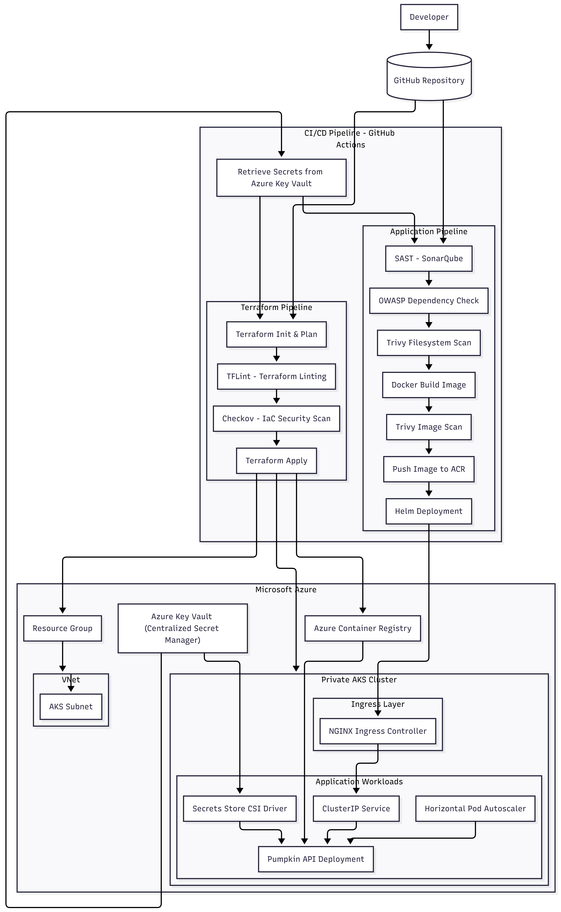

The platform is designed as a secure and scalable cloud-native deployment on Microsoft Azure. It uses Infrastructure as Code, Kubernetes orchestration, and DevSecOps pipelines.

### Key components include:

• Azure Virtual Network (VNet)  
Provides network isolation and hosts the AKS subnet.

• Private AKS Cluster  
Runs the containerized application workloads in a private networking environment.

• Azure Load Balancer  
Handles external traffic and forwards requests to the Kubernetes ingress layer.

• NGINX or Traefik Ingress Controller 
Manages external HTTP routing into Kubernetes services.

• Kubernetes Workloads  
The Pumpkin API application is deployed using Helm and includes:
- Deployment
- ClusterIP Service
- Horizontal Pod Autoscaler (HPA)

• Azure Container Registry (ACR)  
Stores container images built by the devsecops CI/CD pipeline.

• Azure Key Vault  
Centralized secret management for:
- CI/CD pipeline secrets
- Kubernetes runtime secrets via the Secrets Store CSI Driver

• GitHub Actions CI/CD Pipeline  
Implements DevSecOps workflows for:
- Infrastructure provisioning using Terraform
- Container build and security scanning
- Helm deployment to AKS

• DevSecOps Security Scans
The CI/CD pipeline integrates security checks including:
- SonarQube (SAST)
- OWASP Dependency Check
- Trivy filesystem and image scans
- TFLint and Checkov for Terraform security validation

---

## * Important assumptions and design decisions 

I made a few choices when building this platform to keep things doable but not too basic.

### 1. Private Kubernetes Cluster

The AKS cluster is a **private cluster** inside an Azure Virtual Network. This makes it safer, blocking public access to the Kubernetes API and worker nodes.

Traffic from outside goes through the Azure Load Balancer and NGINX/Traefik Ingress Controller.

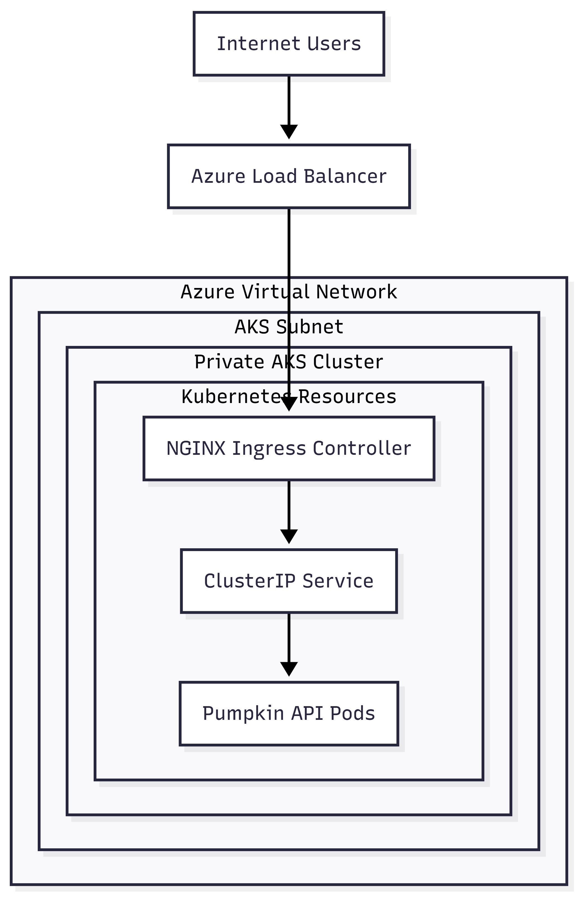

This setup lets us route traffic from one spot, handle security (TLS), and make it easier to expose services.

### 2. Traffic Management with Ingress

I have using an **NGINX/Traefik Ingress Controller** to manage incoming web traffic.

External traffic enters the platform through an Azure Load Balancer. Requests are forwarded to the NGINX Ingress Controller inside the AKS cluster, which routes traffic to the appropriate Kubernetes service and application pods.

Here’s how traffic flows:

Internet User  → Azure Load Balancer  → NGINX/Traefik Ingress Controller  → Kubernetes Service (ClusterIP)  → Pumpkin API Pods

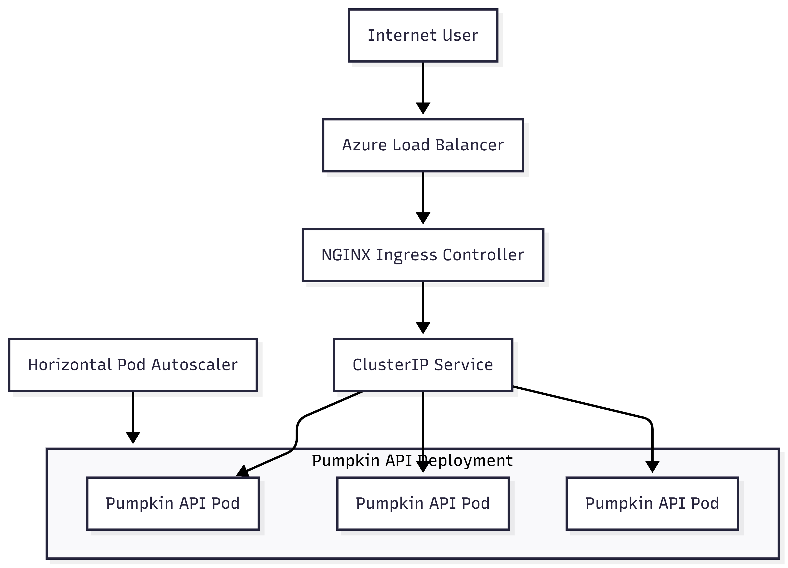

### 3. Deploying Apps with Helm

I'm deploying the application using **Helm charts**, which give us:

- Reusable deployment templates
- Settings for different environments
- Easy upgrades and rollbacks

I went with Helm instead of GitOps tools (like ArgoCD) to keep things simple.

### 4. Infrastructure as Code with Terraform

I'm setting up the infrastructure using **Terraform modules** to make things:

- Reusable
- Easy to maintain
- Consistent across environments

Modules include:

- Network module (VNet + subnets)
- AKS module
- Container Registry module
- Ingress config module

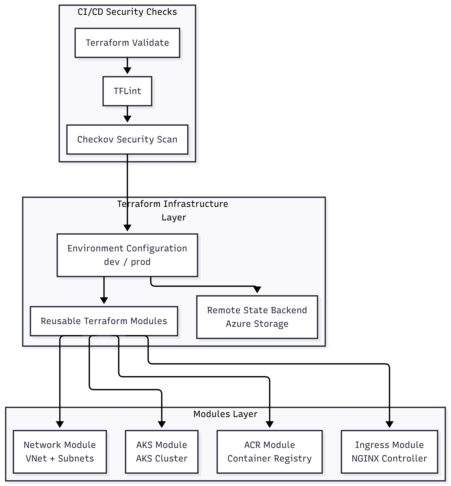

### 5. Separate Environments

The solution supports different environments (dev and prod) using:

- Terraform environment folders
- Terraform variables
- Helm values files

This lets us set up each environment differently without copying code.

### 6. Secure CI/CD Pipeline

The platform uses **GitHub Actions pipelines** with security checks built-in.

The infrastructure pipeline includes:

- Terraform Validate
- TFLint
- Checkov (IaC security scanning)

The application pipeline includes:

- SonarQube SAST scanning
- OWASP Dependency Check
- Trivy filesystem scanning
- Trivy container image scanning

This means we check for security issues before setting up the infrastructure and application.

### 7. Centralized Secret Management

Secrets are kept in **Azure Key Vault**.

We use two ways to get secrets:

1. CI/CD secrets  
GitHub Actions grabs pipeline secrets from Azure Key Vault during execution.

2. Runtime secrets  
Application pods get secrets from Azure Key Vault using the **Secrets Store CSI Driver**.

Which are short term storage can be rotated very easily.

This stops us from storing sensitive info in code repositories or Kubernetes files.

### 8. Container Image Management

Container images are stored in **Azure Container Registry (ACR)**.

The CI/CD pipeline builds and scans container images before pushing them to ACR, so we’re only deploying safe images.

### 9. Application Scaling

I have included Horizontal Pod Autoscaler (HPA) to scale application pods based on how much they’re being used.

This makes sure the service can handle spikes in traffic without us having to do anything manually.


This architecture focuses on security, modular infrastructure design, and DevSecOps practices while keeping the implementation simple enough for demonstration purposes.

---

## * Automated Infrastructure Deployment

Infrastructure for this platform is provisioned using **Terraform** and deployed through a **GitHub Actions CI/CD pipeline (`terraform.yml`)**.

The pipeline follows a **DevSecOps workflow**, ensuring infrastructure code is validated and security-scanned before being applied.

### Pipeline Workflow

The infrastructure pipeline performs the following stages:

1. **Terraform Validate** – validates Terraform configuration syntax  
2. **Terraform Init & Plan** – initializes Terraform and generates the execution plan  
3. **TFLint** – checks Terraform code for best practices and configuration issues  
4. **Checkov** – scans Infrastructure as Code for security misconfigurations  
5. **Terraform Apply** – provisions infrastructure resources in Azure

This ensures infrastructure changes are **automatically validated, security-checked, and deployed consistently**.


### Triggering the Infrastructure Deployment

The Terraform pipeline is triggered automatically when changes are pushed to the terraform.yml pipeline.

Example workflow(main: prod and dev branch : dev):

```bash
git checkout dev ## changing from main to dev branch
git add .github/workflows/terraform.yml
git commit -m "update infrastructure"
git push 
```

### Infrastructure Components Provisioned

The Terraform pipeline provisions the following Azure resources:

- Azure Resource Group

- Azure Virtual Network (VNet)

- AKS Subnet

- Private Azure Kubernetes Service (AKS) Cluster

- Azure Container Registry (ACR)

- Terraform State Locking (Azure Storage + Blob locking)

Infrastructure is organized using Terraform modules and environment-specific configuration.

### Environment Configuration

The repository supports multiple environments:

```bash
terraform/environments/dev
terraform/environments/prod
```
Each environment uses separate Terraform variables while sharing the same infrastructure modules.

---

## * Automated Application Deployment (Helm)

After the infrastructure has been provisioned (AKS cluster and Azure Container Registry), the application is deployed to Kubernetes using **Helm**.

The Helm chart defines the Kubernetes resources required to run the application, including:

- Deployment
- Service
- Ingress
- Horizontal Pod Autoscaler (HPA)
- resource requests and limits
- readiness and liveness probes
- environment-specific configuration

Deployment is automated through the **CI/CD pipeline**, which builds the container image, pushes it to the container registry, and deploys the application to the Kubernetes cluster using Helm.

### Helm Chart Location

The Helm chart for the application is located in:

```bash
git checkout dev ## changing from main to dev branch
git add .github/workflows/deploy.yml
git commit -m "update application deployment"
git push 
```

### Automatically CI/CD Deployment Process
The CI/CD pipeline automatically deploys the application to Azure Kubernetes Service (AKS) after building the container image.

The pipeline performs the Helm deployment using the following command which is mentioned in the CI/CD pipeline for dev
```bash
helm upgrade --install pumpkin-api ./helm/pumpkin-api \
  --set image.repository=<ACR_LOGIN_SERVER>/pumpkin-api \
  --set image.tag=<commit-sha> \
  -f helm/pumpkin-api/values-dev.yaml
```

For production deployments:
```bash
helm upgrade --install pumpkin-api ./helm/pumpkin-api \
  --set image.repository=<ACR_LOGIN_SERVER>/pumpkin-api \
  --set image.tag=<commit-sha> \
  -f helm/pumpkin-api/values-prod.yaml
```

### Verify Deployment

Check that the application has been deployed successfully:

```bash
kubectl get pods
kubectl get svc
kubectl get ingress
```

---

## * Secret Management

Secrets in this platform are managed using **Azure Key Vault** to ensure secure storage and controlled access. The architecture separates secrets used by the **CI/CD pipeline** from those required by the **running application workloads**.

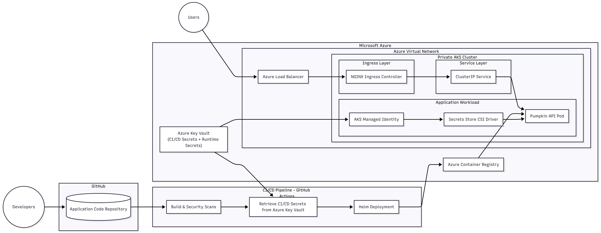

### Centralized Secret Storage

All sensitive information is stored in **Azure Key Vault**, including:

- CI/CD credentials
- container registry authentication
- API keys
- database connection strings
- TLS certificates

Using Azure Key Vault provides:

- centralized secret management
- role-based access control (RBAC)
- secret rotation capabilities
- audit logging

### Managed Identity Authentication

Access to Azure Key Vault is secured using **Azure Managed Identities**.

The AKS cluster uses a **managed identity** to authenticate with Azure Key Vault when retrieving secrets through the Secrets Store CSI Driver.

Using managed identities eliminates the need to store credentials inside Kubernetes manifests or application code.


### Security Benefits

This approach ensures:

- sensitive data is never stored in the repository
- Kubernetes manifests remain free of plaintext secrets
- centralized control over secret access and rotation
- secure delivery of secrets to application workloads
- credential-free authentication using managed identities

---

## * Environment Strategy

The platform supports multiple environments, primarily **development (dev)** and **production (prod)**.  
Environment separation ensures that infrastructure configuration, application settings, and deployment behavior can differ between environments while reusing the same core codebase.

Environment differences are handled through:

- Terraform environment configuration
- Helm values files
- repository structure


### Terraform Environment Configuration

Infrastructure is organized using separate environment directories:

```bash
terraform/environments/dev
terraform/environments/prod
```

Each environment contains its own:

- `terraform.tfvars`
- backend configuration
- environment-specific variables

Example differences:

| Configuration | Dev | Prod |
|---|---|---|
AKS cluster name | `pumpkin-dev-aks` | `pumpkin-prod-aks` |
Resource group | `pumpkin-dev-rg` | `pumpkin-prod-rg` |
Node count | smaller | larger |
Tags | dev environment | production environment |

This approach allows the same Terraform modules to be reused across environments while applying environment-specific configurations.

### Helm Environment Configuration

Application deployments are configured using environment-specific Helm values files:

```bash
helm/pumpkin-api/values-dev.yaml
helm/pumpkin-api/values-prod.yaml
```

Example differences between environments include:

| Configuration | Dev | Prod |
|---|---|---|
Replica count | 1–2 pods | multiple pods |
Resource limits | smaller | higher |
Ingress host | dev domain | production domain |
Autoscaling | minimal | fully enabled |

This allows the same Helm chart to be reused while customizing deployment settings per environment.

### Repository Structure

The repository is structured to clearly separate infrastructure, application deployment, and environment configurations.

This structure ensures:

- clear separation of environments
- reusable infrastructure modules
- consistent deployment patterns across environments

### Benefits of This Approach

Using environment-specific configuration provides:

- safe testing in development before production changes
- consistent infrastructure across environments
- reusable Terraform modules and Helm charts
- simplified configuration management

---

## * Production Improvements

The current implementation demonstrates the core concepts required for the exercise, including infrastructure provisioning, Kubernetes deployment, devsecops CI/CD automation, and secret management.  

For a real production environment, several improvements could be implemented to enhance **security, reliability, scalability, and operational maturity**.

### 1. High Availability and Resilience

To ensure high availability in production:

- Deploy the AKS cluster across **multiple availability zones**
- Configure **multiple node pools** for workload isolation
- Increase **replica counts** for application deployments
- Implement **pod disruption budgets (PDBs)** to prevent service downtime during maintenance time.

### 2. Advanced Networking

Networking could be enhanced with:

- **Azure Application Gateway or Azure Front Door** for global traffic routing
- **Web Application Firewall (WAF)** to protect against common web vulnerabilities
- **Private endpoints** for services such as Azure Container Registry and Key Vault
- **Network policies** in Kubernetes to restrict pod-to-pod communication

### 3. GitOps-Based Deployment

While Helm is used for application deployment, a production platform would benefit from **GitOps-based deployment tools** such as:

- **ArgoCD**

GitOps enables:

- declarative deployments
- automated drift detection
- version-controlled cluster state
- sync between desired state and live state

### 4. Observability 

Production systems require strong observability capabilities:

- **Azure Monitor and Log Analytics** for cluster monitoring
- **Prometheus and Grafana** for metrics visualization
- **centralized logging** using tools such as EFK (Elastic Flauntbit Kirbana) or Azure Monitor
- **Tracing** using tools such as Jaeger or Ázure Application Insights
- **alerting and incident management** Azure Monitor and Log Analytics

These tools provide visibility into application health, performance, and infrastructure status.

### 5. Security Enhancements

Additional security controls would include:

- **Azure Policy for Kubernetes** to enforce compliance tools such as Kyverno
- **container image signing and verification**
- **runtime security monitoring** using tools such as Falco
- **role-based access control (RBAC)** for cluster access tools such as Border0

### 6. CI/CD Pipeline Improvements

The CI/CD pipeline could be further enhanced by:

- adding **automated testing stages**
- implementing **approval gates for production deployments**
- adding **progressive delivery strategies** such as blue/green or canary deployments
- improving **pipeline artifact management** by using dedicated artifact repo such as JFrog or GitHub packages

### 7. Infrastructure Scalability

Infrastructure provisioning could be improved by:

- using **separate Azure subscriptions per environment**
- implementing **Terraform state locking and access policies**
- introducing **infrastructure drift detection**
- automating **cluster autoscaling**

### 8. Backup and Disaster Recovery

Production platforms require backup strategies:

- **AKS cluster state backup**
- **persistent volume backups**
- **container registry replication**
- **disaster recovery plans for critical services** 

### 9. Secret Management Improvements

Although Azure Key Vault is used for secret storage, production systems would also include:

- **fine-grained access policies**
- monitoring of secret access activity

### 10. Cost Optimization and Cost Monitoring

Cost management strategies would include:

- cluster autoscaling
- scheduled scaling for non-production environments
- monitoring of resource usage with Azure cost Management and Azure Advisor
- rightsizing compute resources
- FinOps platforms like CloudHealth / Finout, PowerBI

### Summary

These improvements would strengthen the platform across key areas including:

- security
- scalability
- reliability
- observability
- operational maturity

While the current solution demonstrates the architectural foundations, these enhancements would make the platform fully ready for **production-grade deployment in a real-world environment**.

<hr style="height:3px;border:none;color:#333;background-color:#333;" />

## Extras:

I have implemented a **DevSecOps approach across both Terraform-based infrastructure provisioning and the application deployment CI/CD pipeline. Security, compliance, and quality checks are integrated directly into the automation workflow. This ensures infrastructure and applications are validated through automated scanning, policy enforcement, and secure deployment processes before reaching production environments.

### Automation of Terraform provision :

The Terraform pipeline automates infrastructure provisioning through a secure DevSecOps workflow. It performs Terraform initialization, validation, linting with TFLint, and security scanning using Checkov before executing plan and apply stages. The pipeline authenticates with Azure and retrieves secrets from Key Vault to provision cloud resources such as Resource Groups, Azure Kubernetes Service (AKS), networking components, and supporting infrastructure.

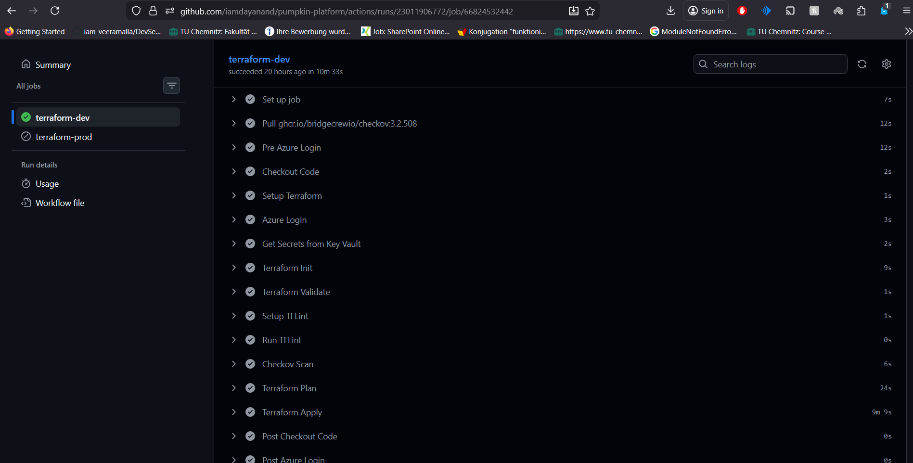

### Automation of Application Deployment:

The application deployment pipeline automates build, security, and delivery processes through a DevSecOps CI/CD workflow. It performs security checks, Dockerfile linting, application build, and container vulnerability scanning before deploying the application. This automated pipeline ensures consistent builds, secure container images, and reliable deployment to the target Kubernetes environment.

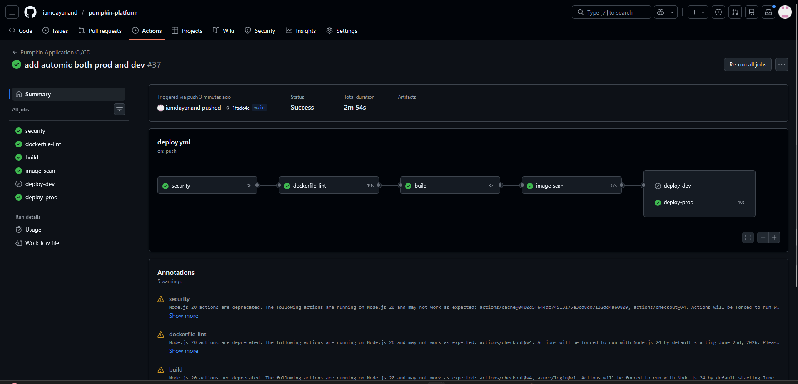

### Hosting application on http://localhost:8082 :

The Pumpkin Platform Demo shows a containerized application successfully deployed on Azure Kubernetes Service (AKS) using Helm. The CI/CD pipeline automates the build, security scanning, container image creation, and deployment process, ensuring consistent and reliable releases. The Kubernetes cluster runs the application as a pod (**pumpkin-api**) with a ClusterIP service exposing port 80 internally. Using kubectl **port-forward**, the service is mapped to **localhost:8082**, allowing local access to the running application. The screenshot demonstrates operational verification through Kubernetes commands such as **kubectl get pods** and **kubectl get svc**, confirming the application is running and accessible within the cluster

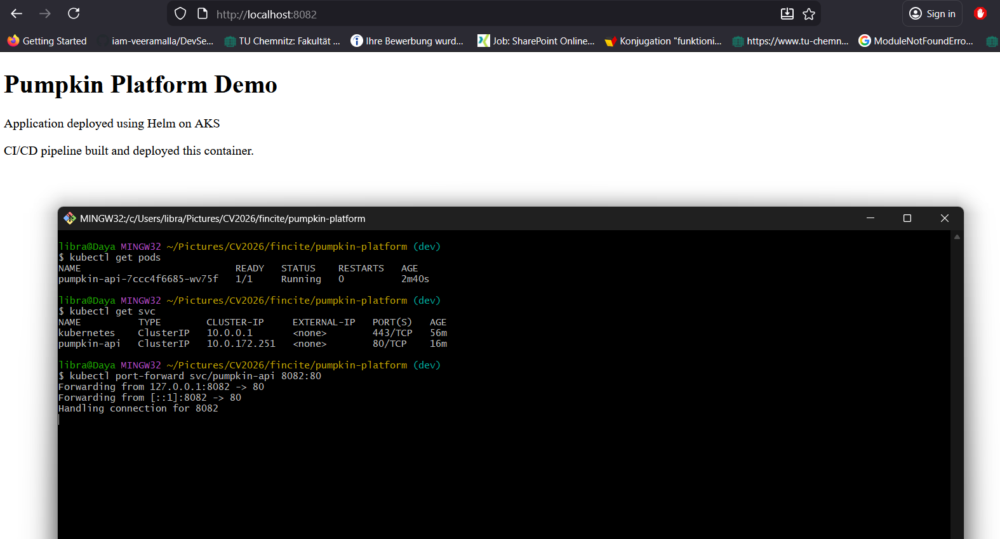

### Hosting application with Ingress Nginx Controller :

The application is exposed externally using the NGINX Ingress Controller deployed on Azure Kubernetes Service (AKS). First, the NGINX Ingress Helm repository is added and updated, and the ingress controller is installed using Helm in the ingress-nginx namespace with the service type configured as LoadBalancer. This automatically provisions an Azure public load balancer and external IP address. After deployment, the controller status is verified using kubectl get svc -n ingress-nginx, confirming that the external IP has been assigned. An Ingress resource is then configured to route external traffic to the pumpkin-api service running inside the cluster. The kubectl get ingress command shows that the application is mapped to the public IP address. Finally, accessing the external IP in a browser successfully loads the Pumpkin Platform Demo application, demonstrating that the CI/CD pipeline, Helm deployment, Kubernetes services, and ingress routing are working correctly.

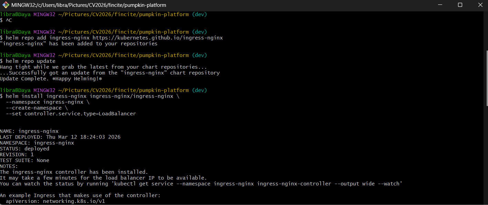

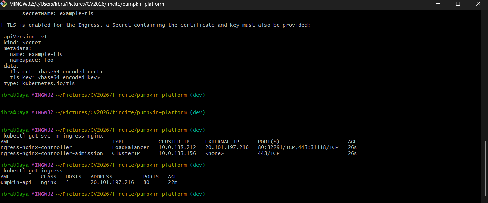

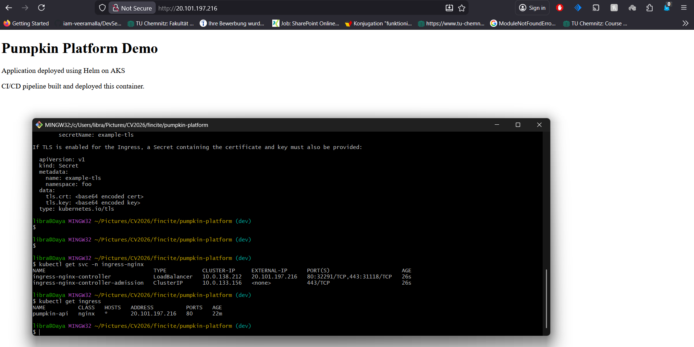

Summary: 

This project demonstrates a complete cloud-native DevSecOps platform deployment on Azure Kubernetes Service (AKS). Infrastructure is provisioned using Terraform with automated security and compliance checks, while the application is built, scanned, and deployed through a CI/CD pipeline. The containerized application is deployed using Helm and exposed externally through an NGINX Ingress Controller with an Azure Load Balancer. Security scanning, infrastructure validation, and automated deployments ensure reliable and secure delivery. The project showcases a fully automated Infrastructure as Code and DevSecOps workflow for modern cloud applications.